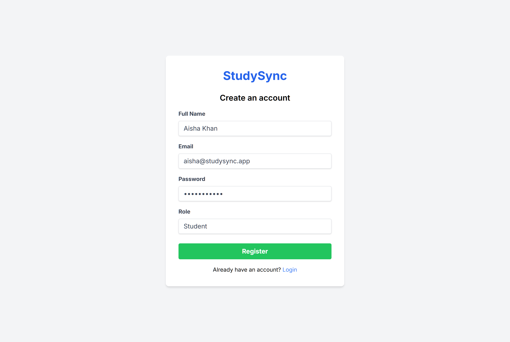
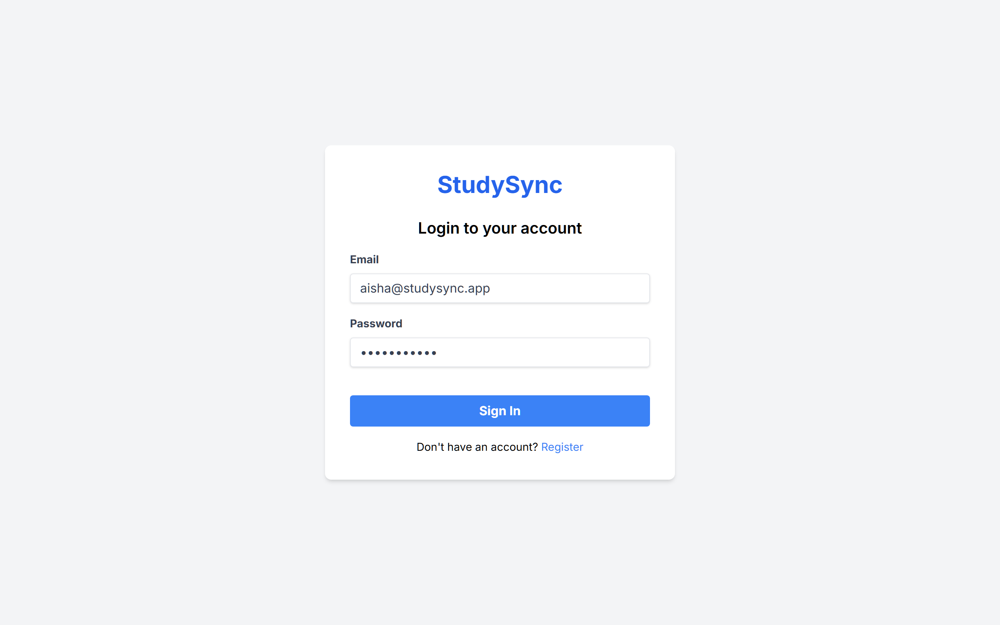
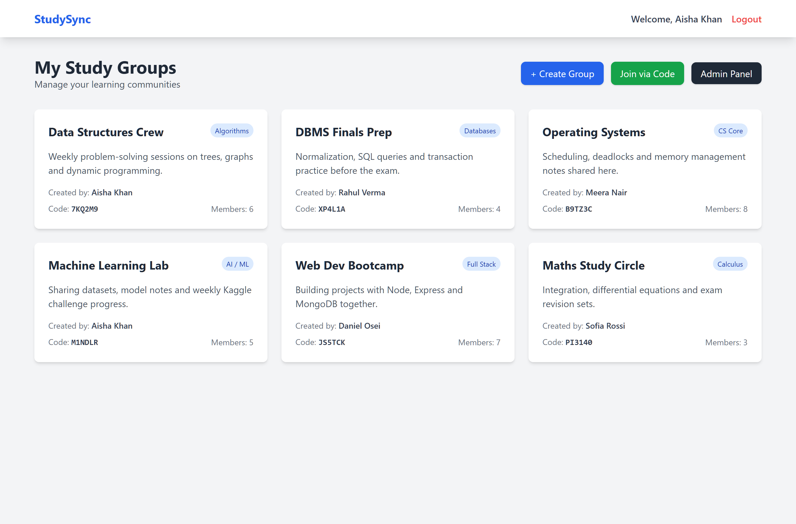
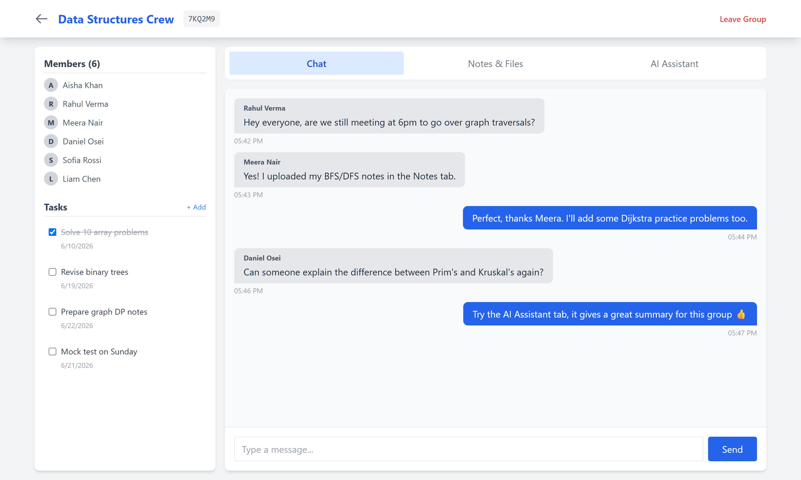
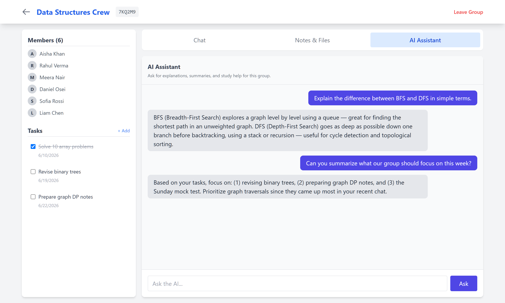
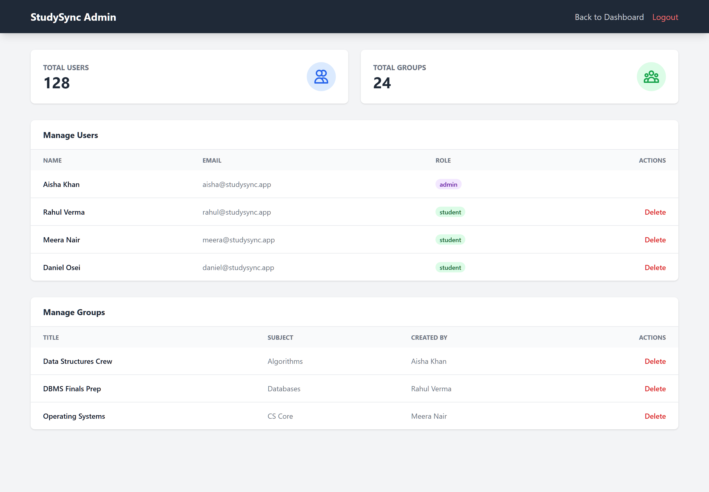
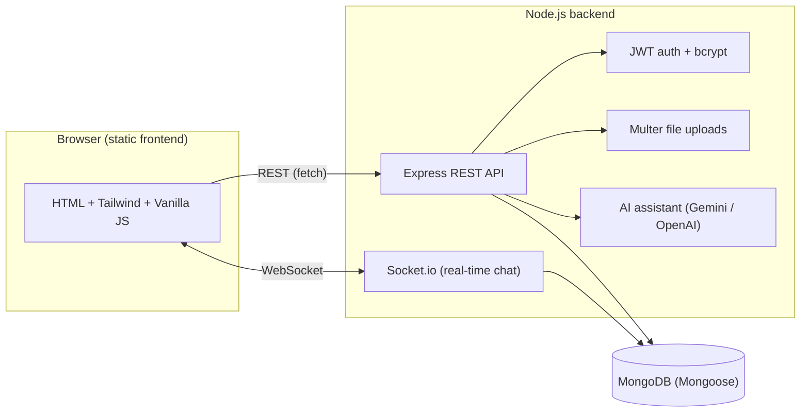

<h1 align="center">StudySync — Collaborative Learning Platform</h1>

<p align="center">
  A full-stack web app where students form study groups, chat in real time,
  share notes &amp; files, track tasks, and get help from a built-in AI study assistant.
</p>

<p align="center">
  
  
  
  
  
</p>

> The application lives in the [`studysync/`](studysync/) folder.

---

## Overview

StudySync turns scattered group study into one organized space. A student signs up,
creates a **study group** (or joins one with a 6-character invite code), and instantly
gets a shared room with **live chat, a shared file library, a task checklist, and an
AI assistant** that knows the group's context. Admins get a dedicated panel to manage
all users and groups on the platform.

It's built as a classic three-tier app: a **vanilla HTML/JS + Tailwind** frontend,
a **Node.js / Express REST API** with **Socket.io** for real-time messaging, and
**MongoDB** for storage — with **JWT** auth and role-based access (student / admin).

---

## Screenshots

### Register &amp; Login
Create an account as a student or admin, then sign in. Auth is handled with JWT + bcrypt.

| Register | Login |
| :---: | :---: |
|  |  |

### Dashboard — your study groups
See every group you've joined as a card, create a new group, or join one with an invite code.



### Group Room — real-time chat
Each group has a live chat (Socket.io), a member list, and a shared task checklist in the sidebar.



### AI Study Assistant
Ask for explanations, summaries, and study tips — the assistant answers in the context of the group.



### Admin Panel
Admins see platform-wide stats and can manage all users and groups.



---

## Architecture



---

## Features

- **Authentication** — register/login with JWT, bcrypt-hashed passwords, role-based access (student / admin).
- **Study Groups** — create groups, join via a 6-character invite code, approve/reject join requests.
- **Real-time Chat** — instant group messaging powered by Socket.io.
- **Notes &amp; Files** — upload and download shared documents (PDF/DOC) per group via Multer.
- **Tasks** — lightweight per-group to-do list with deadlines and completion tracking.
- **AI Assistant** — ask questions and get study help (Gemini / OpenAI, configurable).
- **Admin Panel** — view total users/groups and manage (delete) any user or group.
- **Light &amp; Dark theme** — built-in theme toggle.

---

## Tech Stack

| Layer | Technologies |
| --- | --- |
| **Frontend** | HTML, Tailwind CSS, Vanilla JavaScript |
| **Backend** | Node.js, Express, Socket.io |
| **Database** | MongoDB (Mongoose) |
| **Auth** | JWT, bcrypt |
| **File Upload** | Multer |
| **AI** | Gemini / OpenAI (configurable) |

---

## Quick Start

### Prerequisites
- [Node.js](https://nodejs.org/)
- [MongoDB](https://www.mongodb.com/try/download/community) running locally

### 1. Backend
```bash
cd studysync/backend
npm install
cp .env.example .env   # then edit .env with your own values
npm run dev            # or: npm start
```

### 2. Frontend
The frontend is static HTML/JS. Serve it with any static server:
```bash
cd studysync/frontend
python -m http.server 8000
```
Then open <http://localhost:8000> (or use the VS Code **Live Server** extension).

See [`studysync/README.md`](studysync/README.md) for more detail.

---

## Configuration

All backend configuration is via environment variables. Copy
[`studysync/backend/.env.example`](studysync/backend/.env.example) to
`studysync/backend/.env` and fill in your own values. **Never commit the real
`.env` file** — it is already git-ignored.

---

## License

This project is licensed under the MIT License — see [LICENSE](LICENSE).
